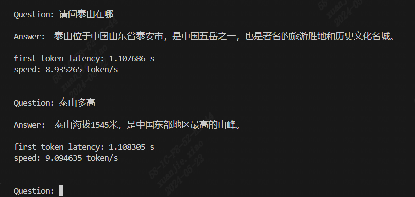

# MiniCPM

本项目实现BM1684X和BM1688部署语言大模型[MiniCPM-2B](https://huggingface.co/openbmb/MiniCPM-2B-sft-bf16)。通过[TPU-MLIR](https://github.com/sophgo/tpu-mlir)编译器将模型转换成bmodel，并采用c++代码将其部署到BM1684X和BM1688的环境。


## 开发环境

1. 下载docker，启动容器，如下：

``` shell
docker pull sophgo/tpuc_dev:latest

# minicpm is just an example, you can set your own name
docker run --privileged --name minicpm -v /dev:/dev -v $PWD:/workspace -it sophgo/tpuc_dev:latest
```
后文默认环境都在docker的`/workspace`目录。


2. 您可以使用方法一，从Huggingface下载`MiniCPM-2B`，比较大，会花较长时间。同时，我们也为您提供了便捷的下载方式，您可以使用下面方法二来下载：

方法一：
``` shell
git lfs install
git clone git@hf.co:openbmb/MiniCPM-2B-sft-bf16
```

方法二：
``` shell
pip3 install dfss
sudo apt-get update
sudo apt-get install unzip
python3 -m dfss --url=open@sophgo.com:sophon-demo/MiniCPM/MiniCPM-2B-sft-bf16.zip
unzip MiniCPM-2B-sft-bf16.zip
```

并使用`files/minicpm-2b`下的`modeling_minicpm.py`替换在 `MiniCPM-2B-sft-bf16` 目录下的原模型的对应文件`modeling_minicpm.py`

3. 下载`TPU-MLIR`代码并编译，(也可以直接下载编译好的release包解压)

``` shell
git clone git@github.com:sophgo/tpu-mlir.git
cd tpu-mlir
source ./envsetup.sh
./build.sh
```

## 编译模型
0. 如果您只是想测试MiniCPM的模型性能，您可以通过dfss直接下载我们已经编译好的模型，如下是下载方法：
如果您想尝试自己导出模型，并编译为bmodel，您可以跳过当前步骤0。
```bash
pip3 install dfss
sudo apt-get update
sudo apt-get install unzip
python3 -m dfss --url=open@sophgo.com:sophon-demo/MiniCPM/bm1688_models.zip
unzip bm1688_models.zip
```

1. 导出所有onnx模型，如果过程中提示缺少某些组件，直接`pip3 install 组件`即可

``` shell
cd compile
python3 export_onnx.py --model_path your_minicpm-2b_path
```
此时有大量onnx模型被导出到tmp目录。模型`seq_length`默认为512，如果想要支持更长序列，请指定`--seq_length your_seq_length`

2. 对onnx模型进行编译
编译BM1684X的模型，进行INT8量化
```shell
./compile_bm1684x.sh --mode int8 --name minicpm-2b
```

目前TPU-MLIR、BM1688支持对MiniCPM进行INT4量化，如果要生成单核模型，则执行以下命令，最终生成`minicpm-2b_int4_1core.bmodel`文件

```shell
./compile_bm1688.sh --name minicpm-2b --num_core 1 
```

如果要生成双核模型，则执行以下命令，最终生成`minicpm-2b_int4_2core.bmodel`文件

```shell
./compile_bm1688.sh --name minicpm-2b --num_core 2 
```

## 编译程序(C++版本)

在开发板上或者X86主机执行如下编译：
您需要根据您使用的开发板及芯片种类进行选择

1、如果您是 `soc BM1688芯片` 请将参数设置为 `-DTARGET_ARCH=soc_bm1688`；

2、如果您是 `soc BM1684x芯片` 请将参数设置为 `-DTARGET_ARCH=soc_bm1684x`；

3、如果您是 `pcie BM1684x芯片` 请将参数设置为 `-DTARGET_ARCH=pcie`；

下面给出了设置为 `soc BM1688芯片`的编译方式：
```shell
cd demo
mkdir build
cd build
cmake -DTARGET_ARCH=soc_bm1688 ..
make
```

编译生成minicpm可执行程序，将`minicpm`放到demo目录下，同时按照下列方式指定芯片数量和bmodel路径。
运行`minicpm`，如运行双核模型`minicpm-2b_int4_2core.bmodel`:
```shell
./minicpm --model ../compile/minicpm-2b_int4_2core.bmodel --tokenizer ../support/tokenizer.model --devid 0
```

## 运行效果

以下为双核INT4量化模式的运行效果：




## 常见问题

#### sentencepiece是怎么来的

工程中已经有编译好的，所以不需要编译，如果好奇的话，参考如下步骤。

下载[sentencepiece](https://github.com/google/sentencepiece)，并编译得到`libsentencepiece.a`

```shell
git clone git@github.com:google/sentencepiece.git
cd sentencepiece
mkdir build
cd build
cmake ..
make -j
```