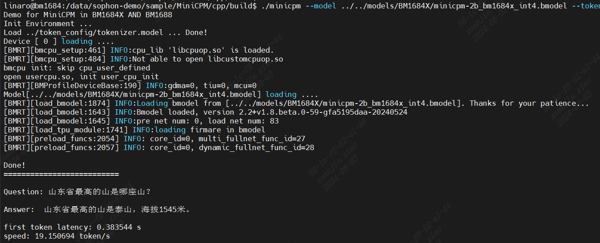

# MiniCPM

## 目录

- [MiniCPM](#minicpm)
  - [目录](#目录)
  - [1. 简介](#1-简介)
  - [2. 运行环境准备](#2-运行环境准备)
    - [2.1 环境部署问题](#21-环境部署问题)
  - [3. 准备模型](#3-准备模型)
    - [3.1 使用提供的模型](#31-使用提供的模型)
    - [3.2 开发环境准备](#32-开发环境准备)
    - [3.3 编译模型](#33-编译模型)
  - [4. 编译例程](#4-编译例程)
  - [5. 运行效果及性能](#5-运行效果及性能)

## 1. 简介

MiniCPM 是面壁与清华大学自然语言处理实验室共同开源的系列端侧语言大模型，主体语言模型 MiniCPM-2B 仅有 24亿（2.4B）的非词嵌入参数量。

该例程目前只提供了C++版本，支持BM1688芯片和BM1684X芯片，支持在插有1684X系列加速卡的x86主机上运行，也可以SOC模式下的SE9和SE7上运行。

1、对于1684X芯片，支持在(libsophon_0.5.0)及以上的SDK上运行；

2、对于1688芯片，支持在(libsophon0.4.9)及以上的SDK上运行。

其中在SE7上运行需要使用 `libsophon>=0.5.0` 的刷机包，如果遇到报错，请参照[运行环境准备](#2-运行环境准备)完成环境部署。

## 2. 运行环境准备

以下为soc模式相关：

### 2.1 环境部署问题

我们为您提供了较新的SE7刷机包，您可以使用下面的下载方式进行下载，然后按照官网的刷机方式进行刷机。

```shell
pip3 install dfss
python3 -m dfss --url=open@sophgo.com:sophon-demo/MiniCPM/sdcard.tgz
tar -zxvf sdcard.tgz
```


## 3. 准备模型

该模型目前支持在BM1688和BM1684X上运行，已提供编译好的bmodel。

### 3.1 使用提供的模型

​本例程在`scripts`目录下提供了相关模型载脚本`download.sh`

```bash
# 安装unzip，若已安装请跳过，非ubuntu系统视情况使用yum或其他方式安装
sudo apt-get update
sudo apt install unzip
chmod -R +x scripts/
./scripts/download.sh
```

执行程序后，当前目录下的文件如下：

```shell
.
├── cpp
│   ├── CMakeLists.txt
│   ├── demo.cpp                            #主程序
│   ├── include_bm1684x                     #1684x编译所需头文件
│   ├── include_bm1688                      #1688 编译所需头文件
│   ├── lib_pcie                            #1684X pcie编译所需链接库
│   ├── lib_soc_bm1684x                     #1684x编译所需链接库
│   ├── lib_soc_bm1688                      #1688 编译所链接库
│   ├── README.md                           #例程说明
│   ├── requirements.txt                    #需求库
│   └── token_config                        #token文件及模型
├── docs
│   └── FAQ.md                              #问题汇总
├── pics                                    #图片文件
│   ├── image.png
│   ├── Show_Results.png
│   └── sophgo_chip.png
├── README.md
└── scripts                                #下载及模型编译脚本等
    ├── compile                            #模型编译文件
    │   ├── compile_bm1684x.sh             #编译1684X的脚本
    │   ├── compile_bm1688.sh              #编译1688的脚本
    │   ├── export_onnx.py                 #导出onnx模型脚本
    │   └── modeling_minicpm.py            #模型文件
    └── download.sh
```

**注意：** 在下载模型前，应该保证存储空间大于25GB。

### 3.2 开发环境准备

编译模型需要在x86主机完成。

**注意：** MiniCPM-2B官方库10G左右，转模型需要保证运行内存至少40G以上，导出onnx模型需要存储空间60G以上。

模型编译的详细信息可以参考[MiniCPM-2B-TPU](https://github.com/XuanjieXiao/MiniCPM-2B-TPU.git)。
以下是基本步骤：

1.下载docker，启动容器

```bash
docker pull sophgo/tpuc_dev:latest
# myname1234 is just an example, you can set your own name
docker run --privileged --name myname1234 -v $PWD:/workspace -it sophgo/tpuc_dev:latest
```

当前$PWD应该是sophon-demo/sample/MiniCPM-2B

后文(模型转换过程)假定环境都在docker的/workspace目录。

2.下载MiniCPM-2B

您可以使用方法一，从Huggingface下载`MiniCPM-2B`，比较大，会花较长时间。同时，我们也为您提供了便捷的下载方式，您可以使用下面方法二来下载：

方法一：

``` shell
git lfs install
git clone git@hf.co:openbmb/MiniCPM-2B-sft-bf16
```

方法二：

``` shell
pip3 install dfss
sudo apt-get update
sudo apt-get install unzip
python3 -m dfss --url=open@sophgo.com:sophon-demo/MiniCPM/MiniCPM-2B-sft-bf16.zip
unzip MiniCPM-2B-sft-bf16.zip
```

将解压后的文件放至/compile路径下

并对该工程做如下修改：

使用`scripts/compile`下的`modeling_minicpm.py`替换在 `MiniCPM-2B-sft-bf16` 目录下的原模型的对应文件`modeling_minicpm.py`

3.下载`TPU-MLIR`代码并编译，(也可以直接下载编译好的release包解压)

``` shell
git clone git@github.com:sophgo/tpu-mlir.git
cd tpu-mlir
source ./envsetup.sh
./build.sh
```

4.下载[sentencepiece](https://github.com/google/sentencepiece)，并编译得到`sentencepiece.a`

我们也在对应的编译文件夹下内置了相关的 `libsentencepiece.a` (已集成在 `support\lib_XXX`目录下), 您可以直接使用而无需额外的编译操作。

您也可以参考下面的编译操作来编译您处理器架构的`libsentencepiece.a`。

```shell
git clone git@github.com:google/sentencepiece.git
cd sentencepiece
mkdir build
cd build
cmake ..
make -j
```

如果要编译SoC环境，则需要在cpp的`CMakeLists.txt`加入如下代码：

```cmake
set(CMAKE_C_COMPILER aarch64-linux-gnu-gcc)
set(CMAKE_ASM_COMPILER aarch64-linux-gnu-gcc)
set(CMAKE_CXX_COMPILER aarch64-linux-gnu-g++)
```

(如果需要重新编译sentencepiece,也需要在sentencepiece的`CMakeLists.txt`进行上述修改)

5.下载最新的libsophon库并安装

因该例程对libsophon的版本需求比较高，故而您所使用的libsophon可能不支持，但是我们给您提供了能够支持的libsophon版本，
您可以直接使用 `support`文件夹下的对应的libsophon，如果您还有其他的问题，您可以直接参考[FAQ](./docs/FAQ.md)。

### 3.3 编译模型

0.下载`TPU-MLIR`代码并编译，(也可以直接下载编译好的release包解压)

``` shell
git clone git@github.com:sophgo/tpu-mlir.git
cd tpu-mlir
source ./envsetup.sh
./build.sh
```

1.导出所有onnx模型，如果过程中提示缺少某些组件，直接`pip3 install 组件`即可

``` shell
cd compile
python3 export_onnx.py --model_path your_minicpm-2b_path
```

此时有大量onnx模型被导出到tmp目录。模型`seq_length`默认为512，如果想要支持更长序列，请在 `export_onnx.py`脚本运行时指定`--seq_length your_seq_length`

2.对onnx模型进行编译，生成bmodel，这个过程会花一些时间，最终生成`minicpm-XXX.bmodel`文件

2.1 编译BM1684X的模型，进行INT8量化

```shell
./compile_bm1684x.sh --mode int8 --name minicpm-2b
```

2.2 目前TPU-MLIR、BM1688支持对MiniCPM进行INT4量化，如果要生成单核模型，则执行以下命令，最终生成`minicpm-2b_int4_1core.bmodel`文件

```shell
./compile_bm1688.sh --name minicpm-2b --num_core 1 
```

如果要生成双核模型，则执行以下命令，最终生成`minicpm-2b_int4_2core.bmodel`文件

```shell
./compile_bm1688.sh --name minicpm-2b --num_core 2 
```

针对BM1688，其中num_core决定了后续所需要使用的推理芯片的内核数量, mode目前支持
"int4"(scripts/download.sh 中提供已经转好的`1 core 和 2 core`bmodel),提供的模型文件均可以在执行scripts/download.sh 中下载

## 4. 编译例程

C++例程的详细编译请参考[C++例程](./cpp/README.md)

在开发板上或者X86主机执行如下编译：
您需要根据您使用的开发板及芯片种类进行选择

1、如果您是 `soc BM1688芯片` 请将参数设置为 `-DTARGET_ARCH=soc_bm1688`；

2、如果您是 `soc BM1684x芯片` 请将参数设置为 `-DTARGET_ARCH=soc_bm1684x`；

3、如果您是 `pcie BM1684x芯片` 请将参数设置为 `-DTARGET_ARCH=pcie`；

下面给出了设置为 `soc BM1688芯片`的编译方式：

```shell
cd cpp
mkdir build
cd build
cmake -DTARGET_ARCH=soc_bm1688 ..
make
```

编译生成minicpm可执行程序，将`minicpm`放到cpp目录下，同时按照下列方式指定芯片数量和bmodel路径。
运行`minicpm`，如运行双核模型`minicpm-2b_int4_2core.bmodel`:

```shell
./minicpm --model ../models/bm1688_models/minicpm-2b_int4_2core.bmodel --tokenizer ../support/tokenizer.model --devid 0
```

您在运行的时候可能会遇到有报错，请参考[FAQ](./docs/FAQ.md)进行解决。

## 5. 运行效果及性能
根据测试，我们得到了如下表的模型性能表：
|    测试平台   |     测试程序      |        测试模型        |speed|
| -----------  | ---------------- | ---------------------- | --------  |
|   1684X PCIE | demo.cpp  | minicpm-2b_bm1684x_int4_1core |    15 token/s  |
|   SE7-32     | demo.cpp  | minicpm-2b_bm1684x_int4_1core |    20 token/s  |
|   SE9-16     | demo.cpp  | minicpm-2b_bm1688_int4_1core  |    8  token/s  |
|   SE9-16     | demo.cpp  | minicpm-2b_bm1688_int4_2core  |    9 token/s  |

以下为BM1688双核INT4量化模式的运行效果：


